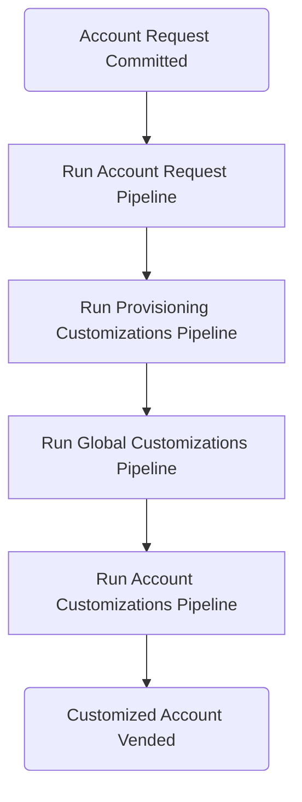
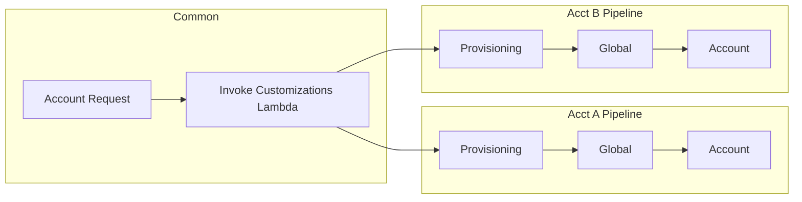

## Key Concepts

To understand Account Factory for Terraform (AFT), where are a couple key AWS concepts you should be familiar with.

### AWS Organizations

[AWS Organizations](https://docs.aws.amazon.com/organizations/latest/userguide/orgs_introduction.html) is an AWS offering that lets you combine numerous AWS accounts under centralized, top-down management. It's useful for isolating resource usage, billing, etc. It also allows enforcing org-wide Service Control Policies (SCPs) that limit what member accounts are allowed to do (e.g. "Only allow creating AWS resources in X, Y, and Z regions").

### AWS Control Tower

[AWS Control Tower](https://docs.aws.amazon.com/organizations/latest/userguide/services-that-can-integrate-CTower.html) extends AWS organizations to provide even more control over member accounts. It also provides a mechanism for creating AWS Accounts within the organization and applying common settings such as trusted access for GuardDuty, CloudTrail logging and forwarding, and more.

### AWS IAM Identity Center

[AWS IAM Identity Center](https://docs.aws.amazon.com/singlesignon/latest/userguide/what-is.html) is an SSO service from AWS. This is how you should grant access to the member accounts in your AWS Organization. You set it up in the Admin Account for the org and manage all user creation there. You can assign users to groups, which in turn are attached to [Permission Sets](https://docs.aws.amazon.com/singlesignon/latest/userguide/permissionsetsconcept.html) on a per-account basis.

## What is Account Factory for Terraform (AFT)?

In the words of [the AWS documentation](https://docs.aws.amazon.com/controltower/latest/userguide/aft-overview.html):

> Account Factory for Terraform (AFT) sets up a Terraform pipeline to help you provision and customize accounts in AWS Control Tower. AFT provides you with the advantage of Terraform-based account provisioning while allowing you to govern your accounts with AWS Control Tower.

AFT is, at its core, an AWS-created terraform module you can use to easily create new AWS accounts from "templates" you manage in your organization. For example, you might use these "templates" to ensure all AWS accounts created for your organization are connected to your security tooling, have a VPC created that meets your standards, and optionally, an EKS cluster. And it's all managed using Terraform!

This immensely useful capability is, behind the scenes, also rather complex. At the risk of being overly reductive, it's a lot of Lambda functions triggering CodePipeline executions which run the Terraform "templates" and Python scripts you write. In reality, AFT leverages [a minimum of 15 AWS services](https://docs.aws.amazon.com/controltower/latest/userguide/aft-components.html) to work its magic.

Logically speaking, the process looks like this:

When the authors of the docs linked above say AFT is "a Terraform pipeline". I say it's more like a meta-pipeline composed of several smaller pipelines.

The Account Request step (which actually creates the account) has a single CodeBuild pipeline—and therefore Terraform state—for _all_ accounts. This pipeline basically ensures the accounts all exist and that their names and emails align with what's in the Terraform. The customizations steps behave differently.

Each customized account vended gets a CodeBuild Pipeline with one job for each customization step. Generally speaking, each customization step can run scripts and/or apply Terraform Because each job is isolated, each Account/Customization Step combination has its own TF state, limiting the potential blast radius of a corrupted statefile and maximizing flexibility.

## Why would you use AFT?

- Your organization either uses or wants to use AWS Organizations and Control Tower.
- You need 5+ AWS accounts now and/or are likely to add more in the future.
- You're working on your compliance stance (HighTrust, SOC II, etc.)

The first time I deployed AFT, it managed 8 AWS accounts from day one. We added many more after that. Between our compliance needs and our own drive to build well-architected systems, setting up each account individually would've taken a _lot_ of work.

With AFT, we could operate more like a Platform team than a traditional DevOps team. We handled networking, ECS clusters, standard IAM policies, security tooling, log centralization, and more during the account vending process via AFT. As a result, our software teams got immediately useful environments that were guaranteed secure and compliant by default, but also easy to use. Furthermore, vending new accounts took about 5 minutes of work.

## Why would you NOT use AFT?

- You don't use AWS Organizations or Control Tower
- You don't need to create new AWS accounts regularly or consistently

The second bullet here is really important. I've worked at orgs where we had 2 AWS accounts, and that was all we needed. If that's you, you don't need AFT and that's just fine.

The most important measure of success for a DevOps engineer is working cloud infrastructure that supports the needs of the business.

## Next Steps

If AFT is a good fit for you and you want to try it out, I recommend contacting your AWS rep and asking for some credits to do so.

When you're ready to get started, [deploy AFT following the AWS documentation](https://docs.aws.amazon.com/controltower/latest/userguide/aft-getting-started.html). After it's deployed, set up [the necessary git repositories](https://docs.aws.amazon.com/controltower/latest/userguide/aft-post-deployment.html) to start using it.
